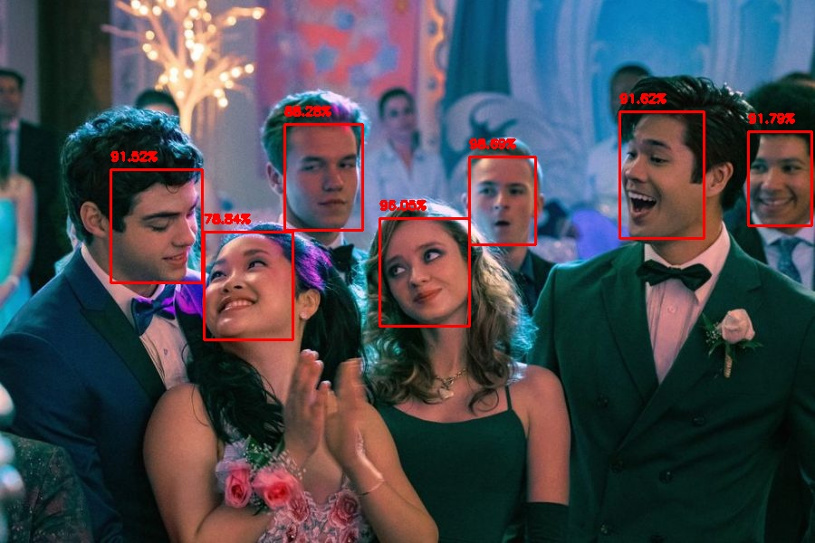

# Face Detector
This projects perform fast, accurate face detection with OpenCV using a pre-trained deep learning face detector model shipped with the library.
- For face detection, Single Shot Detector (SSD) framework with a ResNet base network model (Caffe based model) is used.



## Prerequisites

Python 3.6 or later with dependencies [requirements.txt](requirements.txt) installed. Run:

```
$ pip install -r requirements.txt
```

## Getting Started

To run the program using single image, perform:

```
$ python detect_faces.py --prototxt deploy.prototxt.txt --model res10_300x300_ssd_iter_140000.caffemodel --image image1.jpg
```

To use video streaming, perform
```
$ python detect_faces_video.py --prototxt deploy.prototxt.txt --model res10_300x300_ssd_iter_140000.caffemodel
```

## References

1. Face detection with OpenCV and deep learning: https://www.pyimagesearch.com/2018/02/26/face-detection-with-opencv-and-deep-learning/
